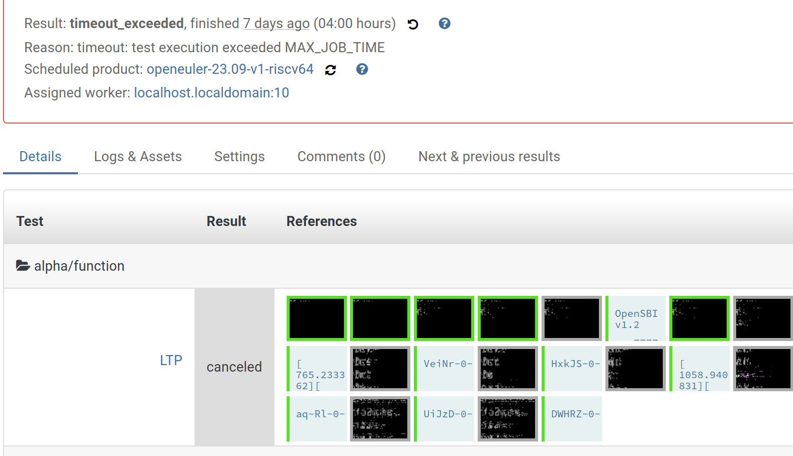

# Week 2

+ [x] use local machine to do some tests
+ [x] adapt the `LTP` cases to openQA
+ [x] make all the tests using new structure 
+ [x] fix python script to process the result of `fio` test

## Results

+ csmith: [make_log](./res/csmith-make_2023-09-18.log) ;  [log](./res/csmith-2023-09-18.log)

+ lib_micro: [log](./res/lib_micro-2023-09-13.log)

    

+ yarpgen: [make_log](./res/yarpgen-make_2023-09-15.log) ;  [log](./res/yarpgen-2023-09-15.log)

+ fio: [log](./res/fio-2023-09-18.log) ;  [result_csv](./res/fio-2023-09-18.csv)

+ LTP: test not finished (consume more than **24** hour)

    

    

## Pull Requests

https://gitee.com/yan-mingzhu/os-autoinst-distri-openeuler/pulls/1

https://gitee.com/yunxiangluo/open-euler-risc-v-23.09-test/pulls/55

