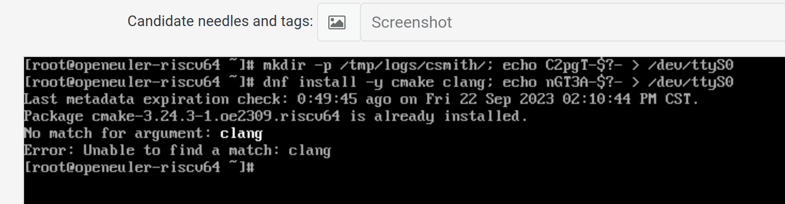

### Week 3

+ [ ] use remote mathine to run test
+ [x] upload logs when test failed
+ [x] tests on openEuler rc3

  + fio:[log](./res/fio-2023-09-22.log) ; [result](./res/fio-2023-09-22.csv)
  + yarpgen: failed
  + lib_micro: failed

+ [ ] mugen

### Pull Requests

https://gitee.com/yan-mingzhu/os-autoinst-distri-openeuler/pulls/2

https://gitee.com/yunxiangluo/open-euler-risc-v-23.09-test/pulls/55

### Issues

`testing/20230921`

