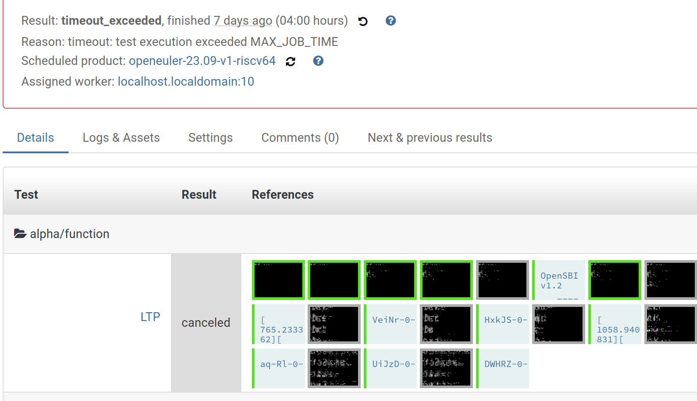

# Month 3

## Test Cases

### Week 1

+ Add 6 test cases under AlphaTest [Case](https://gitee.com/zzzsyyy/os-autoinst-distri-openeuler/commit/bed74ba398b3ae6a612163286ab4984947a98eee), [Needle](https://gitee.com/zzzsyyy/os-autoinst-needles-openeuler/commit/0101ba93f202158e2b29740f8390eb17b38cbe16)

    + performance

        + [x] fio
        + [x] libMicro

    + compilers

        + [x] AnghaBench
        + [x] csmith
        + [x] dejagnu
        + [x] yarpgen

+ Add a mirror repo

    + [x] [AnghaBench](https://gitee.com/zzzsyyy/AnghaBench)

### Week 2

+ [x] use remote links
+ [x] test other lib func
+ [x] adapt `oerv` lib

    + function
        + [x] LTP (consume long time more than 12 hour)

#### Results

+ csmith: [make_log](./res/csmith-make_2023-09-18.log) ;  [log](./res/csmith-2023-09-18.log)

+ lib_micro: [log](./res/lib_micro-2023-09-13.log)

    

+ yarpgen: [make_log](./res/yarpgen-make_2023-09-15.log) ;  [log](./res/yarpgen-2023-09-15.log)

+ fio: [log](./res/fio-2023-09-18.log) ;  [result_csv](./res/fio-2023-09-18.csv)

+ LTP: test not finished

    

    

## Pull Requests

https://gitee.com/yan-mingzhu/os-autoinst-distri-openeuler/pulls/1

https://gitee.com/yunxiangluo/open-euler-risc-v-23.09-test/pulls/55

### Week 3

+ [ ] upload logs when test failed
+ [ ] use remote mathine to run test?

+ [ ] mugen

## Issues

+ [x] `process.py` failed to run in `fio` test case

+ [x] `clang` failed to run in `csmith` test case

## RESULTS

+ Success: `fio`, `lib_micro`, `yarpgen`

+ partial success: `gcc` in `csimth`

+ no enough time to finish test : `LTP`, `anghaBench`, `dejagnu`
